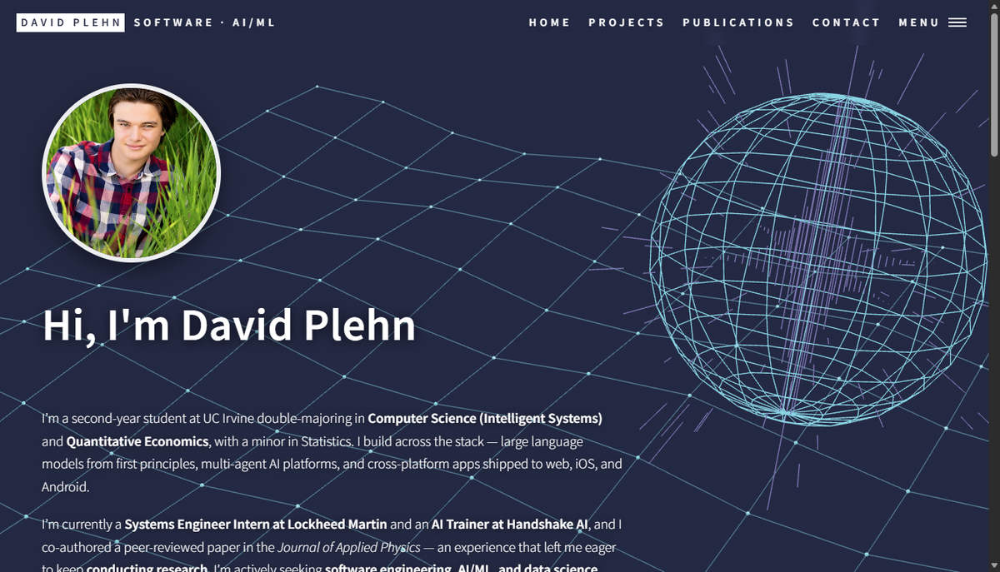

# Plehndm.github.io

Personal portfolio of **David Plehn** — software, AI/ML projects, and research.

A fully custom [Jekyll](https://jekyllrb.com/) site — no theme, no CSS framework. Dark-indigo "cyberpunk terminal" design with an interactive particle-network hero, a typed terminal boot sequence, and data-driven content. Deployed to GitHub Pages via GitHub Actions.

Live: https://plehndm.github.io



## Design system

- **Palette** — deep indigo (`#0b0f1e`) base, cyan `#6ee7ff` primary accent, violet `#a99be8` secondary, amber for WIP statuses. All tokens live as CSS custom properties at the top of `assets/css/main.scss`.
- **Type** — [Chakra Petch](https://fonts.google.com/specimen/Chakra+Petch) (display), [IBM Plex Sans](https://fonts.google.com/specimen/IBM+Plex+Sans) (body), [IBM Plex Mono](https://fonts.google.com/specimen/IBM+Plex+Mono) (terminal, labels, tags).
- **Motion** — scroll-triggered reveals, card hover micro-interactions, animated nav underlines, canvas particle network, terminal typing. Everything respects `prefers-reduced-motion` and degrades gracefully without JavaScript.

## Editing content

Content is data-driven — most updates never touch markup:

| What | Where |
|------|-------|
| Name, tagline, email, résumé path, repo link | `_config.yml` |
| Hero heading + bio | `index.md` (`landing-title` + body markdown) |
| Current roles ("What I'm doing now" + terminal status log) | `_data/roles.yml` |
| Publications (homepage cards + terminal status log) | `_data/publications.yml` |
| Research experience ("Research" section) | `_data/research.yml` |
| Social links (contact section + footer) | `_data/socials.yml` |
| Projects (cards + detail pages) | `_posts/YYYY-MM-DD-slug.md` |
| Résumé PDF | `assets/pdf/David_Plehn_Resume.pdf` |
| Images | `assets/images/` |

### Add or edit a project

Each project is one file in `_posts/`. **Card order = post date, newest first** (dates are ranking, not chronology — change a date to reorder). Front matter drives everything:

```yaml
---
layout: post
title: My Project
description: "One-line caption shown on the card"
image: assets/images/my-screenshot.png   # omit for a styled placeholder
image_alt: "What the screenshot shows"
image_fit: contain      # optional — show the whole image instead of cropping
image_position: center  # optional — which part survives the crop (default: top center)
status: Active        # Active | WIP | Complete | Playable (colors the pill)
category: AI/ML       # shown in the card footer
year: 2026
featured: true        # include in the homepage "Featured projects" grid
repo: https://github.com/you/repo
demo: https://...     # optional — adds a "Live demo" button
tags: [Python, PyTorch, Docker]   # tag pills (cards show 4 + "+N")
---

Intro paragraph.

## Highlights

- Bullet one
- Bullet two
```

The body renders on the project detail page (`/projects/<slug>/`); the GitHub/demo buttons come from front matter, so no HTML needed in posts.

## Local preview

```bash
bundle install
bundle exec jekyll serve   # http://localhost:4000
```

No Ruby installed? Build with Docker:

```bash
docker run --rm -v "$PWD:/srv/site" ruby:3.3 bash -c \
  "gem install jekyll --no-document && jekyll serve --source /srv/site --host 0.0.0.0"
```

## Deployment

GitHub Pages' native builder can't run Jekyll 4.x, so `.github/workflows/deploy.yml` builds the site in CI and publishes it via the official `actions/deploy-pages` flow.

**One-time setup:** Settings → Pages → Source → **GitHub Actions**. Then every push to `main` redeploys automatically.

## Structure

```
_config.yml            site identity + global links
_data/                 roles, publications, socials (YAML)
_posts/                one file per project
_layouts/              default (shell) · home · page · post
_includes/             head, nav, footer (contact), project-card, icons (SVG sprite)
assets/css/main.scss   the whole design system (tokens at the top)
assets/js/main.js      canvas network, terminal boot, reveals, nav — vanilla, no deps
index.md, projects.md, 404.md, sitemap.xml, robots.txt
```
